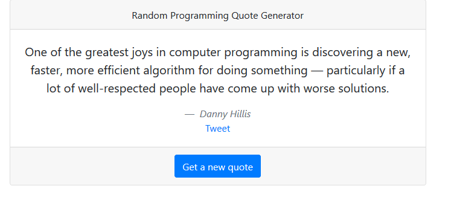

# Random Quote Generator

> Simple random programming quote generator. Check it out here [Live Demo](https://random-quote-generator.artanmuzhaqi.now.sh/)

**Badges**

[](https://travis-ci.org/badges/badgerbadgerbadger)[](http://badges.mit-license.org)

**Screenshot**



---

## Table of Contents

- [Installation](#installation)
- [Features](#features)
- [Technologies](#technologies)
- [Contributing](#contributing)
- [Team](#team)
- [License](#license)

---

## Installation

### Clone

- Clone this repo to your local machine using 

```
git clone https://github.com/muzhaqi16/random-quote-generator.git

cd random-quote-generator
```

### Install

- Run ```yarn install | npm install```

### Start

- Run ```yarn start | npm start```

Open [http://localhost:3000](http://localhost:3000) to view it in the browser.

---

## Features

- Generate a new quote
- Share the quote generated on twitter
---

## Technologies

- HTML
- CSS
- JavaScript
- React.js
- Bootstrap
- [react-bootstrap](https://github.com/react-bootstrap/react-bootstrap)

---

## Contributing

> I would love your contributions at making this repo better and adding new features. 
> To get started at contributing at this repo follow the steps below.

### Step 1

- 🍴 Fork this repo!

### Step 2

- **HACK AWAY!** 🔨🔨🔨

### Step 3

- 🔃 Create a new pull request using <a href="https://github.com/muzhaqi16/random-quote-generator/compare" target="_blank">`https://github.com/muzhaqi16/random-quote-generator/compare`</a>.

---

## Team

   - <a href="https://muzhaqi.com" target="_blank">**Artan Muzhaqi**</a>

---

## License

[](http://badges.mit-license.org)

- **[MIT license](http://opensource.org/licenses/mit-license.php)**
- Copyright 2020 © <a href="http://muzhaqi.com" target="_blank">Artan Muzhaqi</a>.

This project was bootstrapped with [Create React App](https://github.com/facebook/create-react-app).